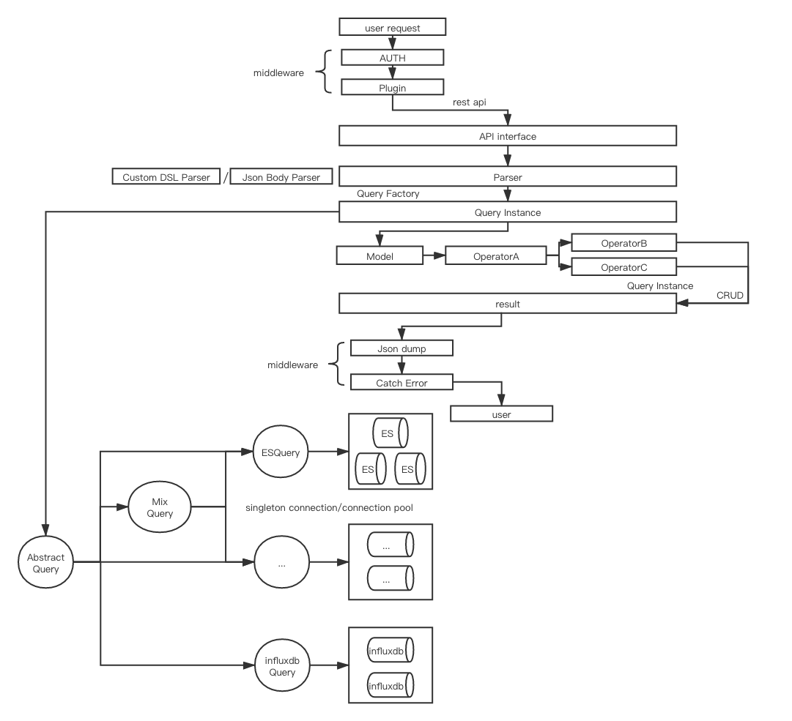

# HostMonitor
monitor metadata of influxdb and ES, rest api support for CRUD metadata and results

# Install

    python3 -m pip install -r requirements.txt

# Run

    # require python3.6+
    # browser open http://localhost:8000/

# TO DO
- [x] framework
- [x] http rest api
- [x] async ES backend
- [ ] async influxdb backend
- [ ] json body parser
- [ ] query factory / abstract method
- [ ] operator
- [ ] unittest
- [ ] directory document
- [ ] docker file

# more

* [elasticsearch install](https://www.elastic.co/guide/en/elasticsearch/reference/current/deb.html)
* [jvm memory error](https://github.com/docker-library/elasticsearch/issues/131)
