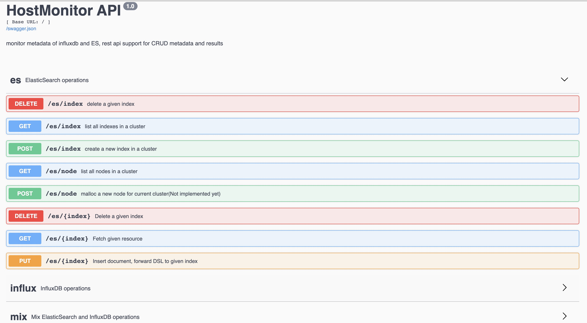

# HostMonitor
monitor metadata of influxdb and ES, rest api support for CRUD metadata and results

# 需求

需要通过统一的管理平台管理不同数据库的元信息, 和数据本身信息查询

基于 [sanic](https://github.com/huge-success/sanic) 事件循环框架搭建API服务, 借助 [sanic-restplus](https://github.com/ashleysommer/sanic-restplus) 提供 rest api

# 流程

用户请求 -> 网关 -> api server -> 权限校验 -> 进入接口代码 -> 路径定位操作的数据库类型,实例 -> 生成Query实例 -> 解析请求body和方法定位到具体的操作 -> 生成 Operator 实例 -> Operator 调用 Query 方法得到结果 -> 经过中间件格式化 -> 返回给用户

* Operator 可以是查询, 添加修改, 拼接, 过滤, 聚合等操作
* Query 实现具体的查询, 添加修改方法, 比如 ESQuery, influxdbQuery, 或者是 mixQuery 同时拿到 ESQuery 和 influxdbQuery 结果聚合后向上层调用者返回
* 解耦后能支持任意类型的自定义查询组合, 或者自定义DSL, 只要语法/查询条件 -> 解析器 -> Operator 能对应上即可

# 结构

    .
    ├── apps // 不同数据库实例/应用对应的接口目录
    │   ├── es
    │   ├── influxdb
    │   ├── mix
    │   └── routes.py
    ├── config // 不同环境的配置信息和默认配置信息
    │   ├── basic.py
    │   ├── local.py
    │   ├── settings.py
    │   └── test.py
    ├── libs  // 框架公共库, 数据库连接单例, 连接池, 错误码, 日志格式, 中间件注册等
    │   ├── code.py
    │   ├── db_util.py
    │   ├── exception.py
    │   ├── http_util.py
    │   ├── logs.py
    │   ├── middlewares.py
    │   ├── rest.py
    │   └── useful.py
    ├── logs // 访问/应用日志目录
    │   ├── access.log
    │   └── app.log
    ├── main.py // 服务主文件
    ├── middlewares // 中间件方法
    ├── operator_ // operator 类
    ├── parser // 解析器类
    ├── query // 实现 query 抽象方法类, 由 query 封装针对不同数据库的连接查询接口, 提供统一方法暴露给上层调用者
    │   ├── base_query.py
    │   ├── es_query.py
    │   ├── influx_query.py
    │   └── query_factory.py
    ├── requirements.txt
    └── routes.py // 路由
    └── unittest_ // 单元测试

# Install

    cd HostMonitor
    python3 -m pip install -r requirements.txt

# test

    cd HostMonitor
    python3 -m unittest

# Run

    # require python3.6+
    # browser open http://localhost:8000/

# TO DO
- [x] framework
- [x] http rest api
- [x] async ES backend
- [x] async influxdb backend
- [x] json body parser
- [x] query factory / abstract method
- [x] operator
- [x] unittest
- [x] directory document
- [ ] docker file

# more

* [elasticsearch install](https://www.elastic.co/guide/en/elasticsearch/reference/current/deb.html)
* [jvm memory error](https://github.com/docker-library/elasticsearch/issues/131)
